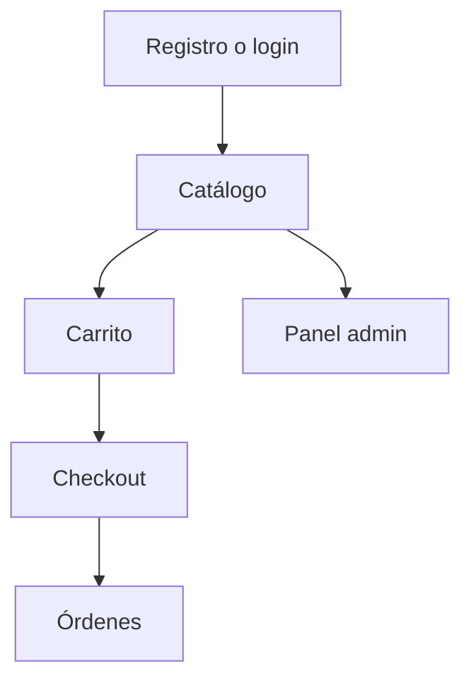

[← Repositorio](../README.md) · [Guía general](../GUIA_DE_NAVEGACION.md) · [Documentación](./docs/README.md)

# Proyecto 01 - E-Commerce Monorepo

Primer proyecto de la materia **Lenguajes Modernos AD2026**.

Este proyecto desarrolla una aplicación e-commerce organizada como monorepo, integrando backend REST, frontend moderno, autenticación, autorización, catálogo, carrito y órdenes.

## Objetivo del proyecto

Construir una aplicación web completa donde el alumno implemente y conecte:

- Backend modular con Express.
- Persistencia con Firestore.
- Validación con Zod.
- Autenticación con JWT.
- Autorización por roles.
- Frontend con Nuxt 4.
- Estado global con Pinia.
- Consumo de API REST.
- Pruebas y documentación.

## Estructura esperada del monorepo

```text
01-ecommerce-monorepo/
├── README.md
├── docs/
│   ├── README.md
│   ├── 00_MAPA_DEL_PROYECTO.md
│   ├── 01_INSTALACION_Y_EJECUCION.md
│   ├── 02_FRONTEND_NUXT4_GUIA.md
│   ├── SESION_01_INSTALACION_FRONTEND.md
│   ├── SESION_02_PRODUCTS_COMPLETO.md
│   ├── SESION_03_AUTH_USERS_JWT.md
│   ├── SESION_04_RBAC_RUTAS_PRIVADAS.md
│   ├── SESION_05_CATEGORIES_CATALOGO.md
│   ├── SESION_06_CART_ORDERS.md
│   └── SESION_07_TESTING_OPENAPI_CIERRE.md
└── ecommerce-monorepo/
    ├── package.json
    ├── .gitignore
    └── apps/
        ├── api/
        └── web/
```

## Stack técnico

### Backend

| Tecnología | Uso |
| --- | --- |
| Node.js | Runtime del backend |
| Express | API REST |
| Firebase Admin SDK | Acceso seguro a Firestore |
| Firestore | Base de datos |
| Zod | Validación |
| bcryptjs | Hash de contraseñas |
| jsonwebtoken | Access token y refresh token |
| Vitest | Pruebas |
| Supertest | Pruebas HTTP |
| Swagger / OpenAPI | Documentación de API |

### Frontend

| Tecnología | Uso |
| --- | --- |
| Nuxt 4 | Framework frontend |
| Vue 3 | Componentes |
| TypeScript | Tipado |
| Pinia | Estado global |
| Tailwind CSS | Estilos |
| Playwright | Pruebas E2E |

## Sesiones del proyecto

| Sesión | Archivo | Resultado |
| --- | --- | --- |
| 01 | [`SESION_01_INSTALACION_FRONTEND.md`](./docs/SESION_01_INSTALACION_FRONTEND.md) | Instalación inicial del frontend |
| 02 | [`SESION_02_PRODUCTS_COMPLETO.md`](./docs/SESION_02_PRODUCTS_COMPLETO.md) | Módulo Products |
| 03 | [`SESION_03_AUTH_USERS_JWT.md`](./docs/SESION_03_AUTH_USERS_JWT.md) | Auth, Users y JWT |
| 04 | [`SESION_04_RBAC_RUTAS_PRIVADAS.md`](./docs/SESION_04_RBAC_RUTAS_PRIVADAS.md) | Roles y rutas privadas |
| 05 | [`SESION_05_CATEGORIES_CATALOGO.md`](./docs/SESION_05_CATEGORIES_CATALOGO.md) | Categorías y catálogo |
| 06 | [`SESION_06_CART_ORDERS.md`](./docs/SESION_06_CART_ORDERS.md) | Carrito y órdenes |
| 07 | [`SESION_07_TESTING_OPENAPI_CIERRE.md`](./docs/SESION_07_TESTING_OPENAPI_CIERRE.md) | Testing, OpenAPI y cierre |

## Documentación principal

- [Documentación del proyecto](./docs/README.md)
- [Mapa del proyecto](./docs/00_MAPA_DEL_PROYECTO.md)
- [Instalación y ejecución](./docs/01_INSTALACION_Y_EJECUCION.md)
- [Guía Frontend Nuxt 4](./docs/02_FRONTEND_NUXT4_GUIA.md)

## Comandos principales

Instalar dependencias desde la raíz del monorepo técnico:

```bash
npm install
```

Ejecutar backend:

```bash
npm run dev:api
```

Ejecutar frontend:

```bash
npm run dev:web
```

Validar frontend:

```bash
npm run typecheck:web
npm run lint:web
npm run build:web
```

## Flujo funcional esperado



## Checklist general del proyecto

- [ ] Monorepo creado.
- [ ] Backend en `apps/api`.
- [ ] Frontend en `apps/web`.
- [ ] Variables `.env` configuradas.
- [ ] Productos funcionando.
- [ ] Auth funcionando.
- [ ] RBAC funcionando.
- [ ] Categorías funcionando.
- [ ] Carrito funcionando.
- [ ] Órdenes funcionando.
- [ ] Pruebas básicas ejecutadas.
- [ ] Documentación actualizada.

## Regresar al índice general

[Volver a Lenguajes Modernos AD2026](../README.md)
