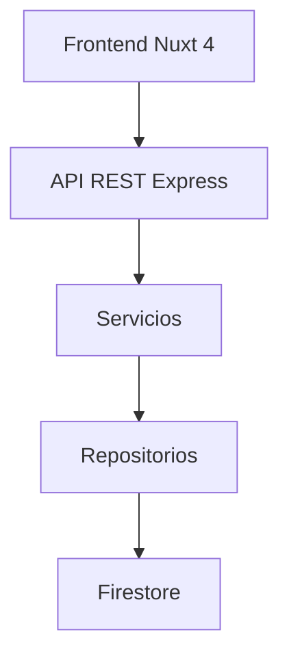
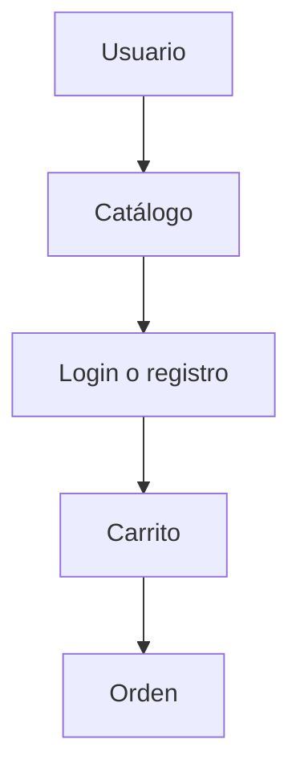
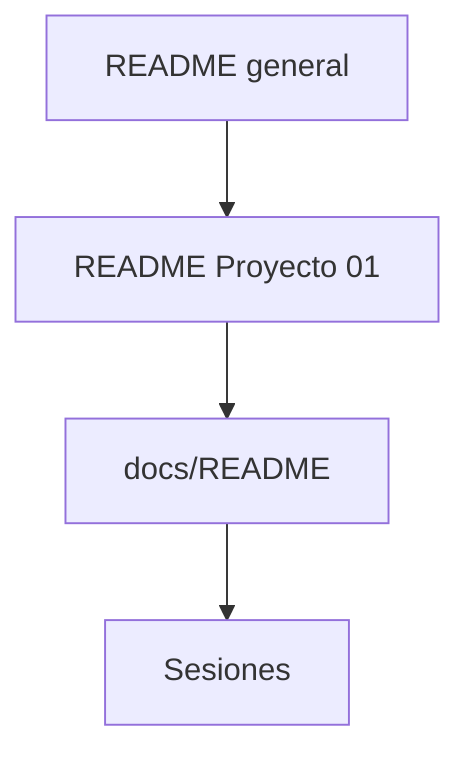

[Repositorio](../../README.md) · [Proyecto](../README.md) · [Índice](./README.md) · [← Proyecto](../README.md) · [01_INSTALACION_Y_EJECUCION.md →](./01_INSTALACION_Y_EJECUCION.md)

# Mapa del Proyecto

Este documento muestra cómo debe organizarse el proyecto `01-ecommerce-monorepo` dentro del repositorio general de la materia.

## Vista general

```text
lenguajes-modernos-ad2026/
├── README.md
└── 01-ecommerce-monorepo/
    ├── README.md
    ├── docs/
    └── ecommerce-monorepo/
```

## Estructura interna del proyecto

```text
01-ecommerce-monorepo/
├── README.md
├── docs/
│   ├── README.md
│   ├── 00_MAPA_DEL_PROYECTO.md
│   ├── 01_INSTALACION_Y_EJECUCION.md
│   ├── 02_FRONTEND_NUXT4_GUIA.md
│   ├── SESION_01_INSTALACION_FRONTEND.md
│   ├── SESION_02_PRODUCTS_COMPLETO.md
│   ├── SESION_03_AUTH_USERS_JWT.md
│   ├── SESION_04_RBAC_RUTAS_PRIVADAS.md
│   ├── SESION_05_CATEGORIES_CATALOGO.md
│   ├── SESION_06_CART_ORDERS.md
│   └── SESION_07_TESTING_OPENAPI_CIERRE.md
└── ecommerce-monorepo/
    ├── package.json
    ├── .gitignore
    └── apps/
        ├── api/
        └── web/
```

## Capas técnicas



## Flujo de usuario



## Módulos del backend

| Módulo | Carpeta | Responsabilidad |
| --- | --- | --- |
| Health | `apps/api/src/modules/health` | Verificar disponibilidad de la API |
| Products | `apps/api/src/modules/products` | Administrar productos |
| Auth | `apps/api/src/modules/auth` | Registro, login y refresh token |
| Users | `apps/api/src/modules/users` | Usuario autenticado |
| Categories | `apps/api/src/modules/categories` | Catálogo de categorías |
| Cart | `apps/api/src/modules/cart` | Carrito del usuario |
| Orders | `apps/api/src/modules/orders` | Creación y consulta de órdenes |

## Módulos del frontend

| Carpeta | Responsabilidad |
| --- | --- |
| `components` | Componentes reutilizables |
| `composables` | Cliente API y lógica compartida |
| `middleware` | Protección de rutas |
| `pages` | Pantallas principales |
| `stores` | Estado global con Pinia |
| `types` | Tipos TypeScript del contrato API |
| `assets/css` | Estilos globales |

## Navegación entre README



## Archivos clave

| Archivo | Uso |
| --- | --- |
| `README.md` raíz | Índice general de la materia |
| `01-ecommerce-monorepo/README.md` | Resumen del proyecto |
| `docs/README.md` | Índice técnico del proyecto |
| `docs/01_INSTALACION_Y_EJECUCION.md` | Instalación completa |
| `docs/02_FRONTEND_NUXT4_GUIA.md` | Implementación del frontend |

## Recomendación

Mantener separados:

- Documentación académica del curso.
- Documentación técnica del proyecto.
- Código fuente del monorepo.

Esto evita que el proyecto se vuelva difícil de navegar conforme crezca.

---

[Repositorio](../../README.md) · [Proyecto](../README.md) · [Índice](./README.md) · [← Proyecto](../README.md) · [01_INSTALACION_Y_EJECUCION.md →](./01_INSTALACION_Y_EJECUCION.md)
