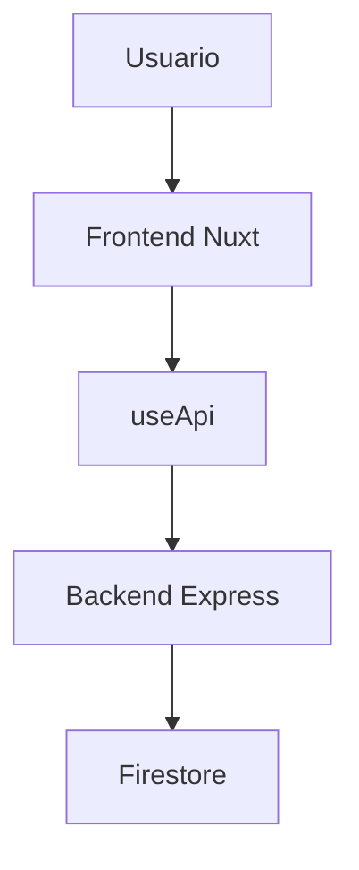

# Guía Frontend Nuxt 4

Esta guía describe cómo debe quedar instalado y organizado el frontend dentro del monorepo.

## Ubicación

El frontend debe vivir en:

```text
ecommerce-monorepo/apps/web
```

## Estructura esperada

```text
apps/web/
├── package.json
├── .env.example
├── nuxt.config.ts
├── app.vue
├── assets/
│   └── css/
│       └── main.css
├── components/
│   ├── AdminProductForm.vue
│   ├── AppHeader.vue
│   ├── EmptyState.vue
│   └── ProductCard.vue
├── composables/
│   └── useApi.ts
├── middleware/
│   ├── admin.ts
│   └── auth.ts
├── pages/
│   ├── index.vue
│   ├── login.vue
│   ├── register.vue
│   ├── cart.vue
│   ├── orders/
│   │   ├── index.vue
│   │   └── [id].vue
│   └── admin/
│       ├── products.vue
│       └── categories.vue
├── stores/
│   ├── auth.ts
│   ├── cart.ts
│   ├── catalog.ts
│   └── orders.ts
└── types/
    └── api.ts
```

## Dependencias

El frontend utiliza:

```bash
npm install nuxt vue vue-router pinia @pinia/nuxt tailwindcss @tailwindcss/vite @nuxt/eslint @nuxt/icon --workspace=@ecommerce/web
```

Dependencias de desarrollo:

```bash
npm install -D typescript vue-tsc vitest @playwright/test --workspace=@ecommerce/web
```

## `apps/web/package.json`

```json
{
  "name": "@ecommerce/web",
  "version": "1.0.0",
  "private": true,
  "type": "module",
  "scripts": {
    "dev": "nuxt dev --port 3000",
    "build": "nuxt build",
    "generate": "nuxt generate",
    "preview": "nuxt preview",
    "typecheck": "nuxt typecheck",
    "lint": "eslint .",
    "test": "vitest run",
    "test:e2e": "playwright test"
  },
  "dependencies": {
    "@nuxt/eslint": "^1.9.0",
    "@nuxt/icon": "^2.0.0",
    "@pinia/nuxt": "^0.11.2",
    "@tailwindcss/vite": "^4.1.17",
    "nuxt": "^4.2.1",
    "pinia": "^3.0.4",
    "tailwindcss": "^4.1.17",
    "vue": "^3.5.24",
    "vue-router": "^4.6.3"
  },
  "devDependencies": {
    "@playwright/test": "^1.56.1",
    "typescript": "^5.9.3",
    "vitest": "^4.0.14",
    "vue-tsc": "^3.1.5"
  }
}
```

## `nuxt.config.ts`

```ts
import tailwindcss from '@tailwindcss/vite'

export default defineNuxtConfig({
  compatibilityDate: '2026-09-13',
  css: ['~/assets/css/main.css'],
  devtools: { enabled: true },
  modules: [
    '@pinia/nuxt',
    '@nuxt/eslint',
    '@nuxt/icon'
  ],
  runtimeConfig: {
    public: {
      apiBaseUrl:
        process.env.NUXT_PUBLIC_API_BASE_URL ??
        'http://localhost:4050/api/v1'
    }
  },
  typescript: {
    strict: true,
    typeCheck: true
  },
  vite: {
    plugins: [
      tailwindcss()
    ]
  }
})
```

## `.env.example`

```env
NUXT_PUBLIC_API_BASE_URL=http://localhost:4050/api/v1
```

## Rutas del frontend

| Ruta | Archivo | Descripción |
| --- | --- | --- |
| `/` | `pages/index.vue` | Catálogo |
| `/login` | `pages/login.vue` | Login |
| `/register` | `pages/register.vue` | Registro |
| `/cart` | `pages/cart.vue` | Carrito |
| `/orders` | `pages/orders/index.vue` | Órdenes |
| `/orders/:id` | `pages/orders/[id].vue` | Detalle de orden |
| `/admin/products` | `pages/admin/products.vue` | Admin de productos |
| `/admin/categories` | `pages/admin/categories.vue` | Admin de categorías |

## Stores Pinia

| Store | Responsabilidad |
| --- | --- |
| `auth.ts` | Login, registro, logout, sesión y rol |
| `catalog.ts` | Productos y categorías |
| `cart.ts` | Carrito y checkout |
| `orders.ts` | Historial y detalle de órdenes |

## Cliente API

El archivo `composables/useApi.ts` centraliza:

- URL base de la API.
- Headers.
- Token Bearer.
- Serialización de query params.
- Lectura de respuestas `{ success, data, meta }`.
- Manejo de errores del backend.

## Middleware

| Middleware | Uso |
| --- | --- |
| `auth.ts` | Protege carrito y órdenes |
| `admin.ts` | Protege productos y categorías admin |

## Flujo esperado



## Comandos

Desde la raíz:

```bash
npm run dev:web
```

Desde `apps/web`:

```bash
npm run dev
```

Validar:

```bash
npm run typecheck:web
npm run lint:web
npm run build:web
```

## Checklist

- [ ] `apps/web` existe.
- [ ] `package.json` del frontend tiene nombre `@ecommerce/web`.
- [ ] `nuxt.config.ts` usa `@pinia/nuxt`.
- [ ] `main.css` importa Tailwind.
- [ ] `.env` apunta al backend.
- [ ] Login consume `/auth/login`.
- [ ] Registro consume `/auth/register`.
- [ ] Catálogo consume `/products`.
- [ ] Carrito consume `/cart`.
- [ ] Órdenes consume `/orders`.
- [ ] Admin consume `/products` y `/categories`.

## Navegación

- [Volver a docs](./README.md)
- [Instalación y ejecución](./01_INSTALACION_Y_EJECUCION.md)
- [README del proyecto](../README.md)

