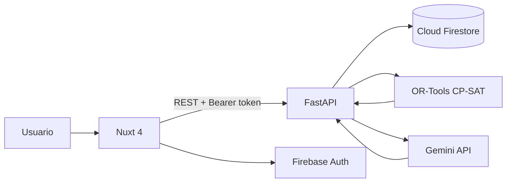

# Proyecto 02 - AulaPlan AI

**AulaPlan AI** es un generador inteligente de horarios académicos construido como proyecto evolutivo para la materia **Lenguajes Modernos AD2026**.

El objetivo principal no es construir otro CRUD. El proyecto utiliza **Python + FastAPI** como backend, **Firebase** para autenticación y persistencia, **Google OR-Tools** para resolver el problema de horarios mediante restricciones y **Gemini API** para interpretar restricciones escritas en lenguaje natural.

El frontend se entrega una sola vez con **Nuxt 4 + Vue 3 + TypeScript + Pinia + Tailwind CSS 4 + daisyUI 5**. Las sesiones posteriores se concentran en backend, Firebase, optimización, IA, pruebas y despliegue.

## Arquitectura



## Producción

```text
GitHub monorepo
│
├── Netlify
│   └── apps/web → Nuxt 4 estático
│
└── Render
    └── apps/api → FastAPI
         │
         ├── Firebase
         ├── OR-Tools
         └── Gemini API
```

> Netlify se utiliza para el frontend. FastAPI se despliega en Render; no se plantea Python como Netlify Function.

## Duración

- **14 sesiones**.
- **1 hora 30 minutos por sesión**.
- **21 horas** de trabajo guiado.

## Stack

| Capa | Tecnología |
| --- | --- |
| Frontend | Nuxt 4, Vue 3, TypeScript strict |
| Estado | Pinia |
| UI | Tailwind CSS 4, daisyUI 5 |
| Backend | Python 3.12, FastAPI |
| Validación | Pydantic |
| Servidor ASGI | Uvicorn |
| Base de datos | Cloud Firestore |
| Auth | Firebase Authentication |
| SDK servidor | Firebase Admin Python SDK |
| Optimización | Google OR-Tools CP-SAT |
| IA | Gemini API mediante `google-genai` |
| Testing | Pytest, HTTPX, Playwright |
| Frontend hosting | Netlify |
| Backend hosting | Render |
| CI | GitHub Actions |

## Resultado funcional final

El coordinador podrá:

- Registrar periodos académicos.
- Administrar profesores.
- Administrar materias.
- Administrar grupos.
- Administrar salones y laboratorios.
- Definir bloques horarios.
- Registrar disponibilidad docente.
- Crear restricciones duras y preferencias.
- Escribir restricciones en lenguaje natural.
- Generar horarios con OR-Tools.
- Revisar conflictos o motivos de inviabilidad.
- Versionar horarios.
- Publicar un horario.
- Consultar horarios por grupo, profesor y salón.

## Sesiones

| # | Archivo | Resultado |
| ---: | --- | --- |
| 01 | [`SESION_01_FOUNDATION_MONOREPO.md`](./docs/SESION_01_FOUNDATION_MONOREPO.md) | Monorepo, Nuxt, Python y FastAPI |
| 02 | [`SESION_02_FASTAPI_ARQUITECTURA.md`](./docs/SESION_02_FASTAPI_ARQUITECTURA.md) | API modular, configuración y OpenAPI |
| 03 | [`SESION_03_FIREBASE_FIRESTORE.md`](./docs/SESION_03_FIREBASE_FIRESTORE.md) | Firebase Admin, Firestore y Emulator |
| 04 | [`SESION_04_ACADEMIC_CORE.md`](./docs/SESION_04_ACADEMIC_CORE.md) | Periodos, profesores y materias |
| 05 | [`SESION_05_GROUPS_ROOMS_BLOCKS.md`](./docs/SESION_05_GROUPS_ROOMS_BLOCKS.md) | Grupos, salones y bloques |
| 06 | [`SESION_06_AVAILABILITY_CONSTRAINTS.md`](./docs/SESION_06_AVAILABILITY_CONSTRAINTS.md) | Disponibilidad y restricciones |
| 07 | [`SESION_07_FIREBASE_AUTH_RBAC.md`](./docs/SESION_07_FIREBASE_AUTH_RBAC.md) | Auth y RBAC |
| 08 | [`SESION_08_SCHEDULING_DOMAIN.md`](./docs/SESION_08_SCHEDULING_DOMAIN.md) | Dominio del problema de horarios |
| 09 | [`SESION_09_ORTOOLS_SOLVER.md`](./docs/SESION_09_ORTOOLS_SOLVER.md) | Solver CP-SAT |
| 10 | [`SESION_10_OPTIMIZACION_PREFERENCIAS.md`](./docs/SESION_10_OPTIMIZACION_PREFERENCIAS.md) | Optimización multiobjetivo básica |
| 11 | [`SESION_11_GEMINI_RESTRICCIONES.md`](./docs/SESION_11_GEMINI_RESTRICCIONES.md) | IA → JSON validado |
| 12 | [`SESION_12_GENERACION_VERSIONADO.md`](./docs/SESION_12_GENERACION_VERSIONADO.md) | Generación E2E y versiones |
| 13 | [`SESION_13_TESTING_QA.md`](./docs/SESION_13_TESTING_QA.md) | Pytest, HTTPX, Emulator y E2E |
| 14 | [`SESION_14_CICD_NETLIFY_RENDER.md`](./docs/SESION_14_CICD_NETLIFY_RENDER.md) | GitHub Actions + deploy |

## Documentos transversales

- [Mapa del proyecto](./docs/00_MAPA_DEL_PROYECTO.md)
- [Instalación y ejecución](./docs/01_INSTALACION_Y_EJECUCION.md)
- [Frontend Nuxt 4 — entrega única](./docs/02_FRONTEND_NUXT4_ENTREGA_UNICA.md)
- [Git y GitHub](./docs/03_GIT_GITHUB_WORKFLOW.md)
- [Modelo Firestore](./docs/04_MODELO_FIRESTORE.md)
- [Contrato API](./docs/05_CONTRATO_API.md)
- [Referencias oficiales](./docs/99_REFERENCIAS_OFICIALES.md)

## Regresar

[Volver al índice general](../README.md)
