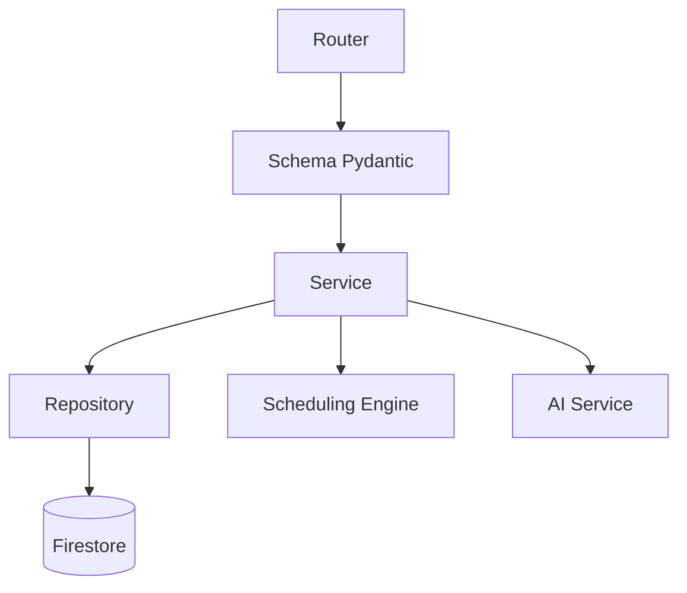
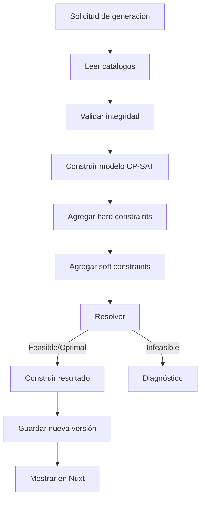

# AulaPlan AI — Mapa del Proyecto

## Objetivo

Definir la estructura que deberá tener el monorepo técnico que el alumno construirá siguiendo las sesiones.

## Repositorio guía vs. repositorio técnico

Este directorio `02-aulaplan-ai` contiene **documentación didáctica**. Durante el curso se creará un repositorio técnico independiente llamado `aulaplan-ai`.

```text
lenguajes-modernos-ad2026/          ← repositorio guía
└── 02-aulaplan-ai/
    └── docs/

                    guía al alumno
                           │
                           ▼

aulaplan-ai/                        ← repositorio técnico
├── apps/web
├── apps/api
├── firebase
├── docs
└── .github
```

## Estructura técnica objetivo

```text
aulaplan-ai/
├── .github/
│   └── workflows/
│       ├── api-ci.yml
│       └── web-ci.yml
├── apps/
│   ├── web/
│   │   ├── app/
│   │   │   ├── assets/css/
│   │   │   ├── components/
│   │   │   ├── composables/
│   │   │   ├── layouts/
│   │   │   ├── middleware/
│   │   │   ├── pages/
│   │   │   ├── plugins/
│   │   │   ├── stores/
│   │   │   └── types/
│   │   ├── public/
│   │   ├── nuxt.config.ts
│   │   └── package.json
│   └── api/
│       ├── app/
│       │   ├── api/v1/
│       │   ├── ai/
│       │   ├── core/
│       │   ├── repositories/
│       │   ├── schemas/
│       │   ├── scheduling/
│       │   ├── services/
│       │   └── main.py
│       ├── tests/
│       ├── requirements.txt
│       ├── requirements-dev.txt
│       └── .python-version
├── firebase/
│   ├── firebase.json
│   ├── firestore.indexes.json
│   └── firestore.rules
├── docs/
├── .editorconfig
├── .gitignore
├── .nvmrc
├── netlify.toml
├── package.json
├── README.md
└── render.yaml
```

## Capas del backend



## Regla de arquitectura

El router no accede directamente a Firestore, OR-Tools o Gemini.

```text
Router → Service → Repository → Firestore
               ├→ Scheduling → OR-Tools
               └→ AI Service → Gemini
```

## Módulos del dominio

| Módulo | Responsabilidad |
| --- | --- |
| `health` | Estado de la API |
| `academic_periods` | Periodos escolares |
| `teachers` | Profesores |
| `subjects` | Materias |
| `groups` | Grupos |
| `rooms` | Aulas y laboratorios |
| `time_blocks` | Bloques disponibles |
| `availability` | Disponibilidad docente |
| `constraints` | Restricciones y preferencias |
| `schedules` | Versiones de horario |
| `auth` | Verificación de Firebase ID Tokens |
| `ai` | Interpretación de lenguaje natural |
| `scheduling` | Construcción y solución CP-SAT |

## Flujo de generación



## Navegación

- [Documentación](./README.md)
- [Instalación](./01_INSTALACION_Y_EJECUCION.md)
- [Sesión 01](./SESION_01_FOUNDATION_MONOREPO.md)
